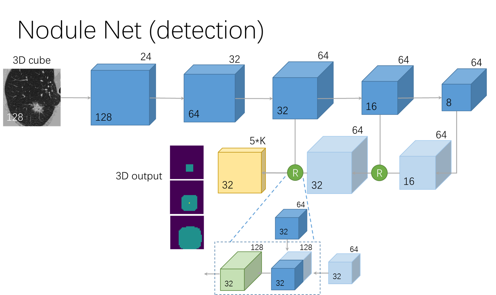
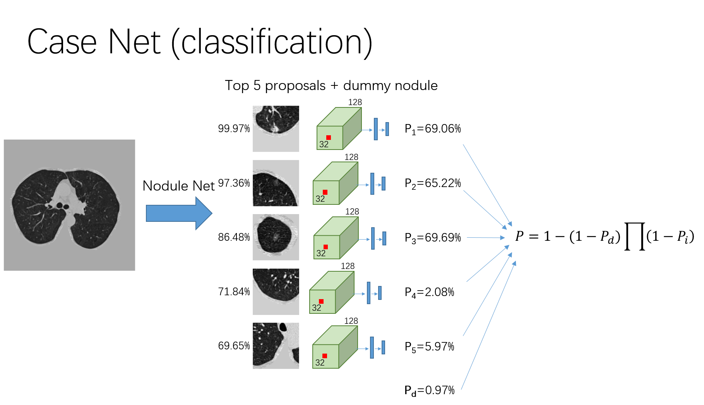

# Paper link 
https://arxiv.org/abs/1711.08324
Please cite this paper if you find this project helpful for your research.

# Dependencies

Ubuntu 14.04, python 2.7, CUDA 8.0, cudnn 5.1, h5py (2.6.0), SimpleITK (0.10.0), numpy (1.11.3), nvidia-ml-py (7.352.0), matplotlib (2.0.0), scikit-image (0.12.3), scipy (0.18.1), pyparsing (2.1.4), pytorch (0.1.10+ac9245a) (anaconda is recommended)

This is my configuration, I am not sure about the compatability of other versions

# Instructions for runing

Testing
1.	unzip the stage 2 data 
2.	go to root folder
3.	open config_submit.py, filling in datapath with the stage 2 data path
4.	python main.py
5.	get the results from prediction.csv

if you have bug about short of memory, set the 'n_worker_preprocessing' in config\_submit.py to a int that is smaller than your core number.

Training 
1.	Install all dependencies
2.	Prepare stage1 data, LUNA data, and LUNA segment results (https://luna16.grand-challenge.org/download/), unzip them to separate folders
3.	Go to ./training and open config_training.py
4.	Filling in stage1_data_path, luna_raw, luna_segment  with the path mentioned above
5.	Filling in luna_data, preprocess_result_path, with tmp folders
6.	bash run_training.sh and wait for the finishing of training (it may take several days)

If you do not have 8 GPUs or your the memory of your GPUs is less than 12 GB, decrease the number of -b and -b2 in run\_training.sh, and modify the 'CUDA\_VISIBLE\_DEVICES=0,1,..,n\_your\_gpu'. The time of training is very long (3~4 days with 8 TITANX).

# Brief Introduction to algorithm
Extra Data and labels: we use LUNA16 as extra data, and we manually labeled the locations of nodules in the stage1 training dataset. We also manually washed the label of LUNA16, deleting those that we think irrelavent to cancer. The labels are stored in ./training./detector./labels.

The training involves four steps
1. prepare data

    All data are resized to 1x1x1 mm, the luminance is clipped between -1200 and 600, scaled to 0-255 and converted to uint8. A mask that include the lungs is calculated, luminance of every pixel outside the mask is set to 170. The results will be stored in 'preprocess_result_path' defined in config_training.py along with their corresponding detection labels.

2. training a nodule detector

    in this part, a 3d faster-rcnn is used as the detector. The input size is 128 x 128 x 128, an online hard negative sample mining method is used. The network structure is based on U-net.
    
3. get all proposals
    
    The model trained in part 2 was tested on all data, giving all suspicious nodule locations and confidences (proposals)
    
4. training a cancer classifier
    
    For each case, 5 proposals are samples according to its confidence, and for each proposal a 96 x 96 x 96 cubes centered at the proposal center is cropped. 
    
    These proposals are fed to the detector and the feature in the last convolutional layer is extracted for each proposal. These features are fed to a fully-connected network and a cancer probability $P_i$ is calculated for each proposal. The cancer probability for this case is calculated as:

    $P = 1-(1-P_d)\Pi(1-P_i)$,
    
    where the $P_d$ stand for the probability of cancer of a dummy nodule, which is a trainable constant. It account for any possibility that the nodule is missed by the detector or this patient do not have a nodule now. Then the classification loss is calculated as the cross entropy between this $P$ and the label. 
    
    The second loss term is defined as: $-\log(P)\boldsymbol{1}(y_{nod}=1 \& P<0.03)$, which means that if this proposal is manually labeled as nodule and its probability is lower than 3%, this nodule would be forced to have higher cancer probability. Yet the effect of this term has not been carefully studied.
    
    To prevent overfitting, the network is alternatively trained on detection task and classification task.

The network archetecture is shown below

